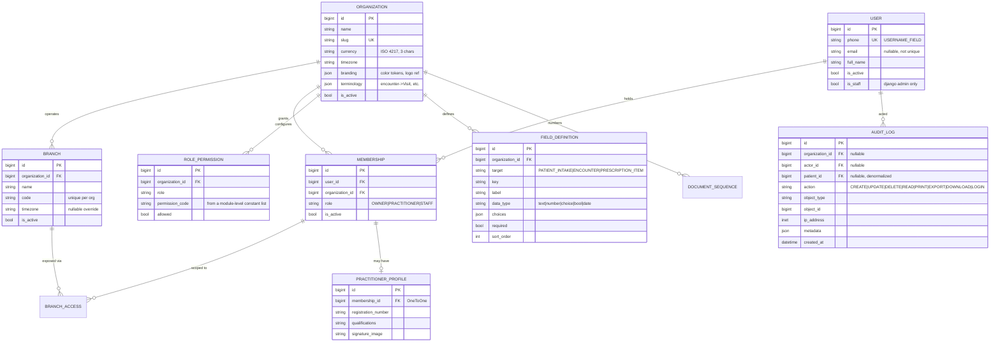
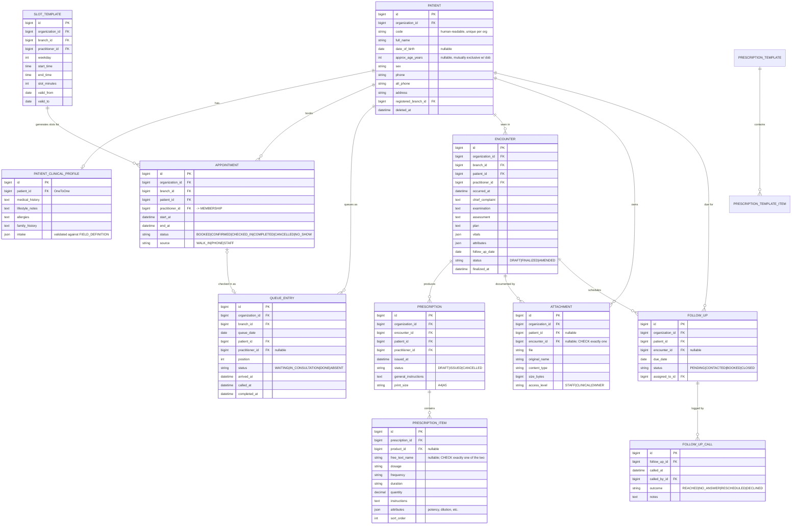
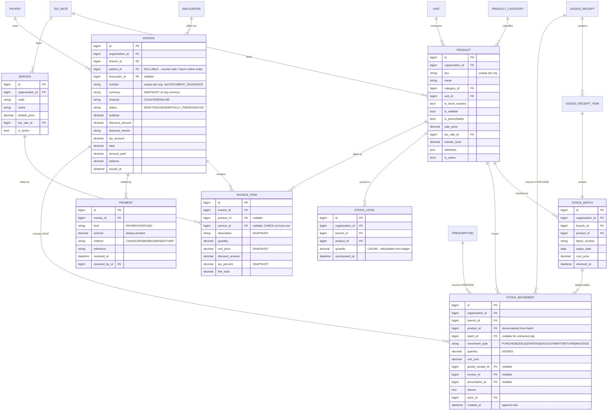

# Clinicore — Phase 0 Proposal

Response to `docs/SPEC.md` §12. Covers the proposed schema and ERD, the component
library choice, pushback on the spec, and the concrete Phase 0 file tree.

---

## 1. Schema and ERD

### 1.1 Foundation (`core`)

Three abstract bases, no table of their own:

- `TimeStampedModel` — `created_at`, `updated_at`.
- `OrgOwnedModel(TimeStampedModel)` — `organization` FK (`PROTECT`), `created_by` FK to `User` (`SET_NULL`), `objects = OrgScopedManager()`, `all_objects = models.Manager()`.
- `SoftDeleteModel` — `deleted_at`, `deleted_by`; applied only to `Patient`, `PatientClinicalProfile`, `Encounter`, `Prescription`, `Attachment`.

`OrgScopedManager` reads the active organization from a `contextvar` set by middleware. See §3(c) — this is the design call most in need of sign-off.

One concrete table in `core`: `AuditLog`.

### 1.2 ERD — tenancy and identity

The ERD is split into three diagrams. A single 30-entity Mermaid graph renders as
spaghetti in the README, and these are the three cluster boundaries that actually
have few edges between them.



`User` is deliberately **not** org-scoped. Phone is the login identifier, so it must
be globally unique; and a practitioner working at two clinics on one deployment gets
one account with two memberships. `Membership` is the tenancy join, and every
permission check resolves through it.

### 1.3 ERD — patients, scheduling, clinical



`django-simple-history` goes on `Patient`, `PatientClinicalProfile`, `Encounter`,
`Prescription`, `PrescriptionItem`.

### 1.4 ERD — catalog, inventory, billing



### 1.5 Decisions considered debatable

**Stock ledger source references — three nullable FKs, not a generic FK.**
`StockMovement` points at `goods_receipt`, `invoice`, or `prescription` via three
nullable columns with a check constraint that at most one is set. A
`GenericForeignKey` would be one column pair but gives up referential integrity and
makes every "show me movements for this invoice" query a two-step. Three nullable
bigints cost nothing.

**`StockLevel` exists as an explicit cache.** §5 says current stock is always
computed from the ledger. A `SUM()` over movements per product per branch is fine at
this size, but the stock list view is per-product-per-branch and would N+1 into an
aggregate. `StockLevel` is written inside the same transaction as the movement, and
`manage.py rebuild_stock_levels` recomputes it from scratch. Tests assert
cache == ledger after every operation. Dropping the cache until it's proven
necessary is an acceptable alternative.

**Invoice numbering via a `DocumentSequence` table with `select_for_update`, not a
Postgres sequence.** Sequences aren't gap-free and aren't per-org without DDL per
tenant. A row lock at 5 concurrent users costs nothing and gives contiguous,
per-org, per-year numbering — which matters because these are financial documents.

**Queue reordering uses a plain integer `position` with no unique constraint,**
renumbered in a service function under `select_for_update` on the day's rows. The
alternative (fractional positions, insert-between) avoids the renumber but produces
ugly values and eventually needs a compaction pass anyway. At one branch-day of ~40
entries, renumbering is a single UPDATE.

**`Patient` carries either `date_of_birth` or `approx_age_years`, not both.**
Walk-in patients in small practices frequently don't know a DOB. Storing a fake DOB
poisons every age calculation; a nullable pair with a check constraint is honest.

**Corrections to a finalized `Encounter` use `simple_history`'s
`history_change_reason`, not a separate amendment table.** The library already
stores the full prior row plus actor plus a reason string. A parallel
`EncounterAmendment` table would duplicate that and then need reconciling. The
service that edits a `FINALIZED` encounter requires a reason argument, sets status
to `AMENDED`, and writes the history row. The "view edit history" screen reads
`encounter.history`.

**Integer PKs, not UUIDs, in URLs.** Sequential IDs are only an IDOR risk if object
lookup isn't org-scoped — and the entire premise of §4 is that it always is. Better
to spend the effort on the isolation test suite than on UUID indexes.

### 1.6 Phase 5 e-commerce additions

The schema is already shaped for it: `Invoice.patient_id` is nullable and
`Invoice.channel` distinguishes counter from online, so a public order produces a
normal invoice with no schema change; `Product.is_sellable`, `sale_price`, and
`tax_rate` are the public catalog's fields already. What Phase 5 adds is a new
`shop` app containing `Cart`/`CartItem` (session- or user-keyed, discarded on
checkout), `Order`/`OrderItem` referencing the resulting `Invoice`,
`DeliveryAddress` FK'd to `Patient`, `Shipment` with a carrier reference, and a
`PaymentIntent` recording gateway state that resolves into an existing `Payment` row
on capture. `Patient` gains an optional `OneToOne` to `User` so a portal login maps
to a patient record — which is also exactly what the Phase 4 patient portal needs,
so those two land together. Nothing existing changes except the addition of nullable
columns.

---

## 2. Component library: DaisyUI

**DaisyUI**, and the deciding factor is HTMX rather than aesthetics. Flowbite ships a
JavaScript layer that binds behaviour to elements on `DOMContentLoaded`; every time
HTMX swaps a fragment containing a modal, dropdown, or tooltip, that markup arrives
with no handlers attached, so you end up writing `htmx:afterSwap` re-initialisation
hooks across the app and debugging the ones you forgot. DaisyUI is a pure Tailwind
plugin — it emits semantic classes (`btn`, `card`, `modal`, `drawer`, `table`) and
ships zero JavaScript, so swapped-in HTML is styled and functional the instant it
lands, with Alpine supplying whatever interactivity the CSS-only patterns don't
cover. It also solves the branding requirement almost for free: DaisyUI themes *are*
CSS custom properties, so per-organization rebranding is a `<style>` block in
`base.html` that overrides `--color-primary` and friends from
`Organization.branding` — a settings change with no rebuild, which is precisely what
§7 asks for. The cost is that DaisyUI's stock look is rounder and more playful than
"clean, calm, clinical", so we define a custom theme from the seed palette on day
one — which we needed to do regardless.

---

## 3. Pushback on the spec

**(a) The role matrix vs. Django's permission system.** §6.1 wants per-organization,
data-driven permissions. Django already has `Permission` and `has_perm`. The proposal
is `RolePermission` as a per-org override table over a module-level list of
permission code constants, resolved by a **custom authentication backend** so that
`user.has_perm("clinical.view_narrative", obj)` works normally and
`PermissionRequiredMixin` keeps working. What this avoids is a bespoke
`can_user_do()` helper that lives beside Django's system and gets forgotten in half
the views. This is the one piece of framework-level machinery being proposed.

**(b) STAFF cannot see clinical data, but STAFF does the billing and dispensing.**
These conflict. An invoice generated from an encounter lists the medicines; the
receptionist who hands the patient a box of tablets necessarily knows what was
prescribed. The spec doesn't resolve this. Recommendation: define "clinical
narrative" as `Encounter.chief_complaint/examination/assessment/plan`,
`PatientClinicalProfile`, and `Attachment` at `CLINICAL`/`OWNER` access level — all
denied to STAFF — while **prescription items are visible to STAFF**, since
dispensing requires it. This needs an explicit ruling because it changes the
permission codes and the tests.

**(c) The organization-scoped default manager needs ambient state, which is exactly
the kind of magic §0 says to justify.** A `contextvar` set by middleware works for
requests and breaks silently in management commands, Celery tasks, and tests unless
every entry point sets it. The proposal: the contextvar-backed default manager *plus*
a hard convention that every `services.py` function takes `organization` as an
explicit first argument and never relies on ambient state, `all_objects` as the
documented escape hatch, and a parametrized test that walks every org-owned model
asserting cross-tenant queries return nothing. The alternative — no ambient state,
explicit `.filter(organization=...)` everywhere — is safer in principle but one
forgotten filter is a data breach, and there's no test that catches "you forgot".
This is the highest-consequence structural decision in the repo.

**(d) The PWA as specified provides installability, not offline capability.** An
app-shell service worker with an offline fallback page means a practitioner who
loses connectivity sees a "you're offline" screen instead of a Chrome dinosaur.
That's the entire benefit. If the clinic has unreliable internet, this doesn't help,
and real offline (queue writes buffered in IndexedDB, sync on reconnect) is a large
project that conflicts with §2's "no realtime". Recommendation: keep the spec as
written but state plainly in the README that the PWA is for installability and
home-screen presence, not offline use.

**(e) `django-simple-history` on "financial models" is partly redundant.**
`StockMovement` is an append-only ledger and `Payment` is never edited — history
tables on them are dead weight that double write volume. Apply history to `Invoice`
and `InvoiceItem` (which do get edited before issue) and skip the immutable ones.

**(f) Read-auditing needs a defined scope.** §8 wants reads of sensitive clinical
data logged. If that's middleware over every request, the audit log becomes
unreadable within a month and every patient list view writes rows. Proposal: an
explicit `@audit_read` decorator / mixin applied to a named set of views — patient
clinical profile, encounter detail, attachment download, prescription print, report
export — and nothing else.

**(g) Attachments on S3 vs. §8's "no public URL".** The obvious S3 pattern is a
short-lived presigned URL, but once issued it bypasses Django's permission check for
its lifetime. Recommendation: always stream through a permission-checked Django
view, keep the storage backend swappable behind `django-storages`, and only reach
for presigned URLs if bandwidth becomes a real problem. Worth an ADR.

**(h) `Organization.currency` alone is insufficient** — a currency change would
silently reprice every historical invoice. `Invoice.currency` is a snapshot. Same
reasoning for `InvoiceItem.unit_price` and `tax_percent`.

**(i) Models required by §6 but absent from §5.** Flagged as additions, per §0:
`Service` (§6.6 bills "services plus products", §6.8 has a "service catalog"),
`TaxRate`, `ProductCategory`, `Unit`, `GoodsReceipt`/`GoodsReceiptItem` (§6.5 goods
receipt), `SlotTemplate` (§6.3 slot templates), `FollowUp`/`FollowUpCall` (§6.3
follow-up tracking with call outcomes), `PractitionerProfile` (§6.4 needs a
registration number and signature on the prescription letterhead),
`PrescriptionTemplate`/`Item` (§6.4 regimen templates), `RolePermission` (§6.1
data-driven matrix), `FieldDefinition` (§5 prescription `attributes` + §5 patient
intake + §6.8 field definitions all describe one mechanism, unnamed),
`DocumentSequence`, `StockLevel`, `BranchAccess`.

**(j) Phase 0's layout shell will be partly rewritten in Phase 1.** The sidebar's
contents depend on role, and roles don't exist until Phase 1. Phase 0 builds the
shell with a hardcoded nav; expect to touch it again.

**(k) SPDX headers: not warranted.** One repository, one licence, `LICENSE` at root
and a line in the README. Per-file headers add noise to every source file for no
benefit at this scale.

**(l) Open question the spec doesn't lock: dependency management.** §3 fixes the
stack but not the tool. Recommendation: `uv` with `pyproject.toml` + `uv.lock` —
fast, lockfile-based, one tool for venv and deps, and it makes the Docker build cache
cleanly. `pip-tools` is the conservative choice.

**(m) Tailwind: standalone CLI, not `django-tailwind`.** `django-tailwind` adds a
`theme` Django app and requires Node inside the container. The standalone binary is a
single download that runs in a Docker build stage and produces one CSS file, leaving
the runtime image Python-only. Tailwind scans templates for class names and emits
only the CSS actually used, so it must run whenever templates change — in dev via
`--watch` alongside `runserver`, in the image build for production.

---

## 4. Phase 0 file tree

```
clinicore/
├── .github/
│   └── workflows/
│       └── ci.yml                    # ruff check, ruff format --check, pytest w/ postgres service, docker build
├── .pre-commit-config.yaml           # ruff, ruff-format, trailing-whitespace, check-merge-conflict
├── .dockerignore
├── .gitignore                        # + .venv_clinicore/, .idea/
├── .env.example
├── Dockerfile                        # multi-stage: tailwind build -> python runtime
├── docker-compose.yml                # web, db
├── docker-compose.override.yml       # dev: bind mounts, runserver, tailwind --watch
├── docker-compose.prod.yml           # web (gunicorn), db, caddy
├── Makefile                          # bootstrap, up, test, lint, fmt, migrate, seed, shell
├── pyproject.toml                    # ruff + pytest + coverage config, project deps
├── uv.lock                           # (pending the answer on 3(l))
├── LICENSE
├── README.md
├── CLAUDE.md
├── manage.py
│
├── caddy/
│   └── Caddyfile
│
├── config/
│   ├── __init__.py
│   ├── settings/
│   │   ├── __init__.py
│   │   ├── base.py                   # django-environ, INSTALLED_APPS, AUTH_USER_MODEL
│   │   ├── dev.py
│   │   ├── prod.py                   # HSTS, secure cookies, whitenoise, storages
│   │   └── test.py
│   ├── urls.py
│   ├── wsgi.py
│   └── asgi.py
│
├── core/                             # ONLY app with real code in Phase 0
│   ├── __init__.py
│   ├── apps.py
│   ├── models.py                     # abstract bases only -> no migration
│   ├── managers.py                   # OrgScopedManager
│   ├── context.py                    # contextvar get/set/override for active org
│   ├── middleware.py                 # sets active org from membership
│   ├── context_processors.py         # org branding + terminology into templates
│   ├── templatetags/
│   │   └── terminology.py            # 
│   ├── migrations/__init__.py
│   └── tests/
│       ├── __init__.py
│       └── test_org_scoping.py
│
├── accounts/            ─┐
├── organizations/        │
├── patients/             │  package skeletons only:
├── scheduling/           ├─ __init__.py, apps.py, models.py (empty),
├── clinical/             │  services.py (empty), migrations/__init__.py,
├── catalog/              │  tests/__init__.py
├── inventory/            │
├── billing/              │
└── reporting/           ─┘
│
├── templates/
│   ├── base.html                     # daisyUI shell, org theme vars, htmx+alpine
│   ├── partials/
│   │   ├── _sidebar.html
│   │   ├── _topbar.html
│   │   ├── _bottom_nav.html          # mobile
│   │   ├── _toast.html
│   │   ├── _empty_state.html
│   │   └── _loading.html             # htmx-indicator
│   ├── print/
│   │   └── base_print.html           # @page A4/A5, no app chrome
│   └── 403.html / 404.html / 500.html
│
├── static/
│   ├── src/
│   │   └── input.css                 # @tailwind + daisyui theme from seed palette
│   ├── css/                          # build output, gitignored
│   ├── js/
│   │   ├── htmx.min.js
│   │   └── alpine.min.js             # vendored, no CDN
│   └── pwa/
│       ├── manifest.webmanifest
│       └── sw.js
│
├── tailwind.config.js
│
├── docs/
│   ├── SPEC.md
│   ├── phase-0-proposal.md           # this file
│   ├── erd.md                        # the three Mermaid diagrams above
│   ├── deployment.md                 # stub, filled in Phase 6
│   └── adr/
│       ├── 0001-htmx-over-spa.md
│       ├── 0002-shared-schema-multitenancy.md
│       ├── 0003-ledger-based-stock.md
│       ├── 0004-daisyui-over-flowbite.md
│       └── 0005-org-scoped-default-manager.md
│
├── conftest.py                       # pytest-django fixtures
└── scripts/
    └── seed.py                       # stub; real synthetic data in Phase 6
```

Two notes on the tree. Apps sit at the repository root as siblings of `config/`,
which is what `startapp` produces and keeps `INSTALLED_APPS` unprefixed; an `apps/`
package is the alternative if the root should be kept tidier. And `core/models.py`
contains only abstract bases in Phase 0, so it generates no migration — `AuditLog`
lands in Phase 1 alongside the models it audits.

---

## 5. Open decisions

Proposed defaults, pending confirmation or override:

1. **Org-scoped manager (3c)** — proceed as proposed: contextvar + middleware,
   `all_objects` escape hatch, services take `organization` explicitly,
   parametrized cross-tenant isolation test over every org-owned model.
2. **STAFF and prescription items (3b)** — default to *visible*. Dispensing is a
   STAFF job; denying it makes the workflow impossible. Narrative fields,
   `PatientClinicalProfile`, and `CLINICAL`/`OWNER` attachments stay denied. This
   is a clinical-privacy policy call rather than a technical one and most needs an
   explicit ruling.
3. **Custom auth backend (3a)** — yes. Keeps `has_perm` and
   `PermissionRequiredMixin` working instead of a parallel helper nobody remembers
   to call.
4. **Dependency tool (3l)** — `uv` + `pyproject.toml` + `uv.lock`.
5. **Additional models (3i)** — accepted; all fourteen are required by §6
   requirements that §5 didn't enumerate.
6. **SPDX headers (3k)** — skip. `LICENSE` at root, one line in the README.